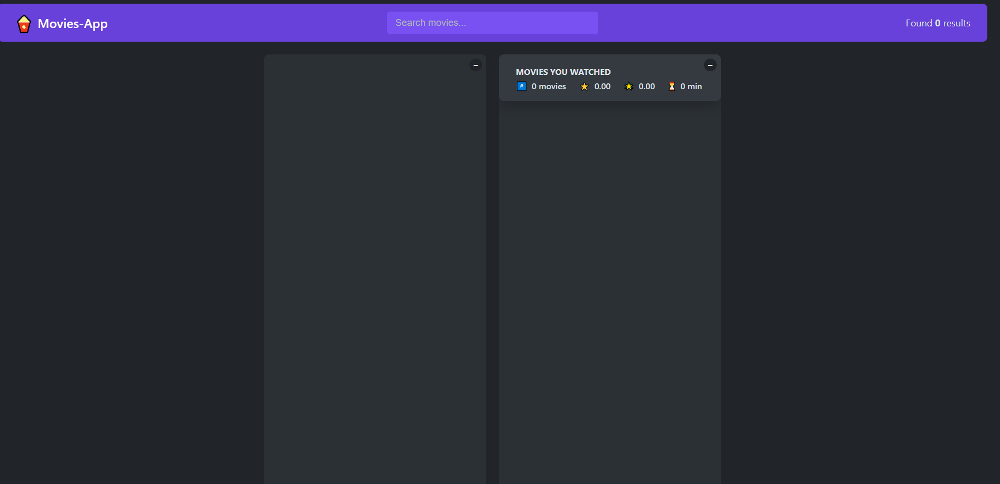
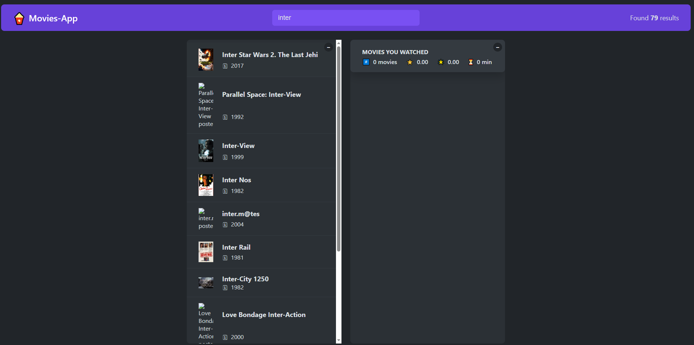
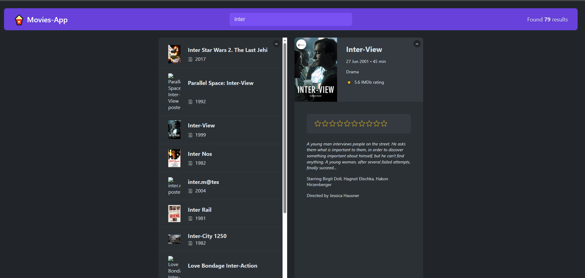
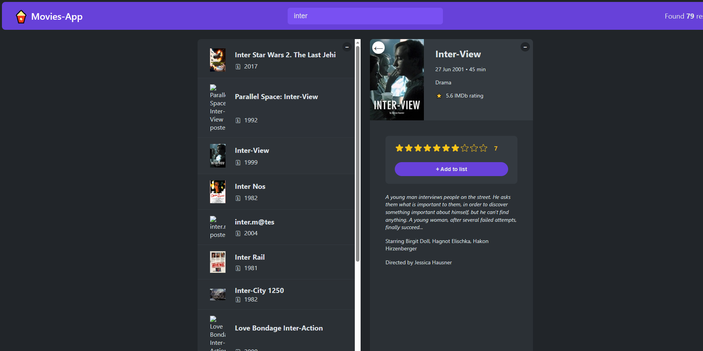
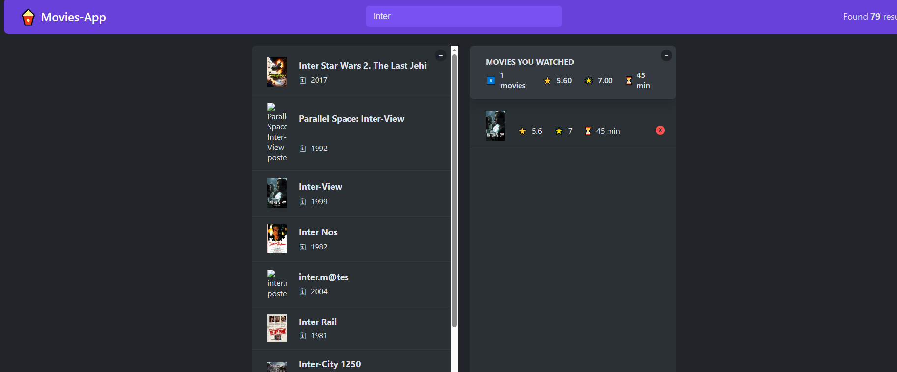
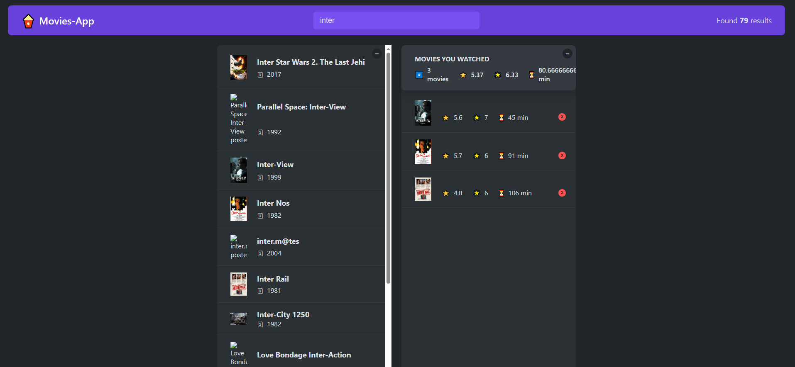

# Movies App

The Movies App is an interactive application that allows users to search for movies by their names in the search bar and receive relevant results. Users can click on a movie to access more detailed information about it and have the ability to add movies to their watch list. The watch list section of the application displays information about the number of movies, the average rating given by the user, and the average rating for all movies on the watch list. Additionally, users can rate movies from 1 to 10, and the data is saved locally in the browser's storage. The application utilizes the OMDb API for movie data and is built using React.js and custom hooks for a seamless user experience.

## Features

1-Search for movies by name in the search bar.

2-View detailed information about each movie.

3-Add movies to the watch list.

4-Watch list statistics: number of movies, average user rating, and average movie rating.

5-Rate movies from 1 to 10.

6-Local storage for data persistence.

## Installation

1-Clone the project repository by executing the following command in your terminal:
https://github.com/Mohamed-Ramadan1/Movies-App.git

2-Install the project dependencies by running : npm install

3-Start the local development server: npm start

## App-preview

